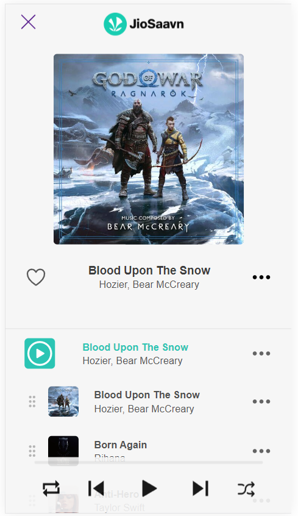

# Saavn Clone



## Usage

Clone it :

```
$ git clone https://github.com/Dibyaranjan450/saavn-clone.git
```

Visit the page at : 

```
https://dibyaranjan450.github.io/saavn-clone/
```

## Contributor

- Creator of saavn-clone @Dibyaranjan450
